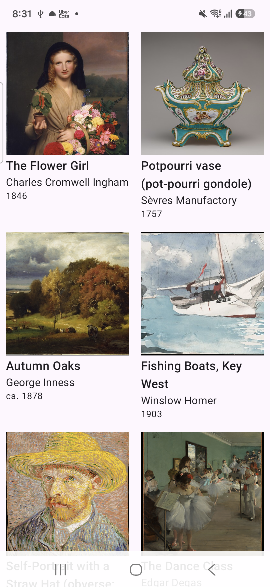

# Kotlin Multiplatform app template

This is a basic Kotlin Multiplatform app template for Android and iOS. It includes shared business logic and data handling, and a shared UI implementation using Compose Multiplatform.

## Screenshots

  

